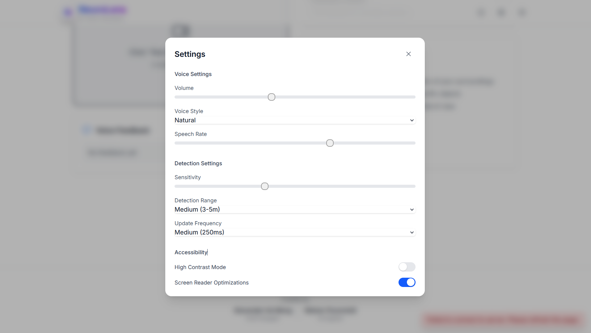

# NeuroLens – AI-Powered Vision Assistant

Empowering independence through real-time object detection and natural voice feedback, NeuroLens assists visually impaired users in navigating their environment with confidence.

[](https://github.com/Dawgsrlife/NeuroLens)
[](https://github.com/Dawgsrlife/NeuroLens/tree/main/frontend)
[](https://github.com/Dawgsrlife/NeuroLens/tree/main/backend)

## 🌟 Features

- Real-time webcam feed processing with YOLO models
- Scene analysis powered by GPT-4
- Natural voice feedback using Web Speech API
- Voice command interaction
- Customizable detection sensitivity and range
- Light/Dark mode with system preference sync
- Comprehensive keyboard shortcuts
- Visual audio captions (e.g., "Footsteps," "Birds chirping")
- High contrast mode and screen reader optimizations

## 📸 Screenshots

### Main Interface
<div align="center">
  
  <p><em>Light Mode Interface</em></p>
  
  <p><em>Dark Mode Interface</em></p>
</div>

### Settings & About
<div align="center">
  
  <p><em>Settings Modal</em></p>
  
  <p><em>About Page</em></p>
</div>

### Keyboard Shortcuts
<div align="center">
  
  <p><em>Keyboard Shortcuts Guide</em></p>
</div>

## 🛠️ Tech Stack

### Frontend
- Next.js 14 (App Router)
- TypeScript 5.8
- Tailwind CSS 4.0
- Framer Motion
- WebSocket API
- Web Speech API
- Libraries: @headlessui/react, @heroicons/react, next-themes, zustand, gsap, lenis

### Backend
- FastAPI
- OpenCV (opencv-python-headless)
- YOLO (ultralytics)
- PyTesseract (OCR)
- OpenAI API (GPT-4)
- Pydub, Sounddevice (audio processing)
- WebSocket server
- Libraries: torch, pydantic, dotenv, httpx

## 🚀 Getting Started

### Prerequisites
- Node.js 18+
- Python 3.8+
- Webcam + Microphone

### Installation

1. Clone the repository:
```
git clone https://github.com/Dawgsrlife/NeuroLens.git
cd NeuroLens
```

2. Install frontend dependencies:
```
cd frontend
npm install
```

3. Install backend dependencies:
```
cd backend
python -m venv venv
# Windows
venv\Scripts\activate
# macOS/Linux
source venv/bin/activate

pip install -r requirements.txt
```

4. Set up environment variables:
```
# frontend/.env.local
NEXT_PUBLIC_WS_URL=ws://localhost:8000/ws

# backend/.env
OPENAI_API_KEY=your_openai_api_key
```

### Running the Application

1. Start the backend:
```
cd backend
uvicorn app.main:app --reload
```

2. Start the frontend:
```
cd frontend
npm run dev
```

3. Open your browser: `http://localhost:3000`

## ⌨️ Keyboard Shortcuts

| Shortcut          | Action                       |
|-------------------|------------------------------|
| `Space`           | Toggle assistant on/off      |
| `Ctrl/Cmd + D`    | Toggle dark/light mode       |
| `Ctrl/Cmd + ,`    | Open Settings Modal          |
| `Ctrl/Cmd + /`    | Open About Page              |
| `Ctrl/Cmd + ⇧ + R`| Start/Stop recording         |
| `Esc`             | Close modals                 |
| `Tab` / `Enter`   | Navigate & activate UI       |

## ♿ Accessibility

NeuroLens is designed with accessibility in mind:
- High contrast mode
- Screen reader support
- Full keyboard navigation
- Adjustable voice feedback and text size

## 🤝 Contributing

1. Fork this repo
2. Create a new branch: `git checkout -b feature/AmazingFeature`
3. Commit your changes: `git commit -m 'Add some AmazingFeature'`
4. Push to GitHub: `git push origin feature/AmazingFeature`
5. Open a Pull Request

## 📄 License

This is a hackathon project created for educational and demonstration purposes. All rights reserved.

## 🙏 Acknowledgments

- OpenAI (GPT, Whisper APIs)
- The open-source community

## 💡 Quote

> "Technology is most powerful when it empowers the most vulnerable."  
> That's the goal of **NeuroLens**.
